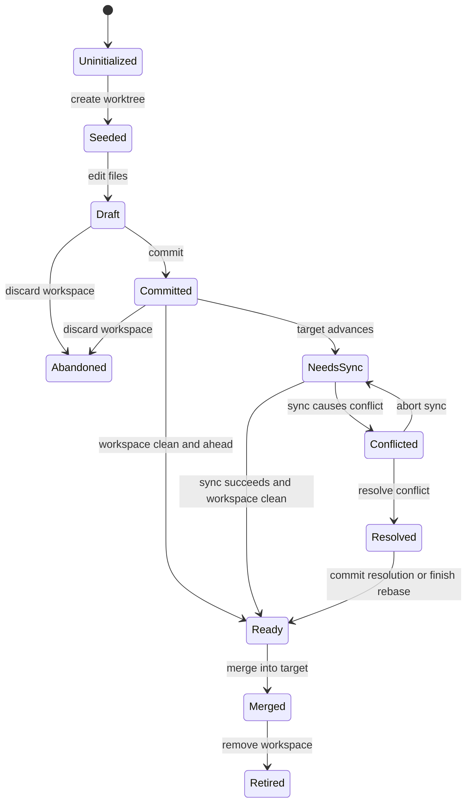

# Workspace Promotion Spec

Date: 2026-03-09
Status: proposed
Owner: web and server

## Intent

Define how a thread workspace moves from isolated local changes to shared repo truth.

This spec answers four questions:

- what promotion state means
- how promotion state is derived from Git facts
- how conflict resolution fits the flow
- what the UI should show at each point

## Core decision

Promotion state is a derived workflow view over Git state.

The app should store only minimal workspace metadata, then compute promotion state from Git facts and delivery facts.

Stored inputs:

- thread id
- workspace path
- source branch
- target branch
- optional archive marker

Derived inputs:

- current `HEAD` for source branch
- current `HEAD` for target branch
- merge base between source and target
- whether the workspace is dirty
- whether the workspace has unmerged paths
- whether the source branch is ahead of target
- whether the source branch is behind target
- whether the source branch has an upstream
- whether a PR is open
- whether target already contains source

## Terms

- Project: one app level repo container
- Repo: shared Git history and refs
- Primary workspace: the main checkout
- Dedicated workspace: a thread scoped worktree
- Source branch: the branch checked out in the active workspace
- Target branch: the branch this workspace intends to land into
- Promotion state: the workflow label derived from Git facts

## Goals

- Make it obvious where a workspace stands relative to shared truth
- Keep worktree isolation easy to understand
- Expose a first class path for conflict resolution
- Make loop closure explicit after merge
- Avoid storing duplicate truth that can drift from Git

## Non goals

- Replace Git concepts with a hidden custom model
- Infer product intent from commit messages
- Automate final merge policy across all repos
- Replace PR review systems

## State model

### Primary states

- `Uninitialized`
  - thread has no dedicated workspace yet

- `Seeded`
  - dedicated workspace exists
  - source and target point at the same commit
  - workspace is clean

- `Draft`
  - workspace has local file changes
  - source has no new commit beyond target

- `Committed`
  - source is ahead of target
  - workspace may be clean or dirty
  - no conflict is active

- `NeedsSync`
  - source is behind target, or source and target have diverged
  - no conflict is active

- `Conflicted`
  - workspace has unmerged paths from merge or rebase

- `Resolved`
  - conflict was resolved in the workspace
  - merge or rebase is complete
  - source is now ahead of target and workspace is clean

- `Ready`
  - source is ahead of target
  - workspace is clean
  - source is not behind target
  - no conflict is active

- `Merged`
  - target contains source
  - workspace may still exist

- `Retired`
  - workspace was removed after merge or discard

- `Abandoned`
  - workspace is intentionally discarded without merge

### Delivery overlays

These are not primary promotion states. They are overlays.

- `Published`
  - source has an upstream branch

- `ReviewOpen`
  - an open PR exists for source into target

- `ChecksPassing`
  - required checks for the PR are green

## State derivation rules

Evaluate in this order.

1. If no dedicated workspace exists for the thread, return `Uninitialized`.
2. If workspace is marked archived after success, return `Retired`.
3. If workspace is marked archived without merge, return `Abandoned`.
4. If target contains source, return `Merged`.
5. If workspace has unmerged paths, return `Conflicted`.
6. If source equals target and workspace is clean, return `Seeded`.
7. If workspace is dirty and source equals target, return `Draft`.
8. If source is behind target, return `NeedsSync`.
9. If source and target have diverged, return `NeedsSync`.
10. If source is ahead of target and workspace is clean and no conflict is active, return `Ready`.
11. If source is ahead of target and workspace is dirty and no conflict is active, return `Committed`.
12. Otherwise return `Committed` as the safe fallback for an ahead source branch.

## Git relation mapping

These facts drive the states.

- source equals target
  - clean workspace gives `Seeded`
  - dirty workspace gives `Draft`

- merge base equals target head
  - source is ahead only
  - clean workspace gives `Ready`
  - dirty workspace gives `Committed`

- merge base equals source head
  - source is behind only
  - gives `NeedsSync`

- merge base is older than both heads
  - source and target diverged
  - gives `NeedsSync`

- unmerged paths exist
  - gives `Conflicted`

- target contains source head
  - gives `Merged`

## Allowed transitions

## Workflow mapping

### 1. Create thread

- if thread stays in primary workspace, promotion flow is inactive
- if thread creates a dedicated workspace, state becomes `Seeded`

### 2. Work in turns

- normal edit turns do not change source branch history
- local changes in the dedicated workspace make state `Draft`

### 3. Commit

- first commit that moves source ahead of target makes state `Committed`
- if the workspace is clean after commit, state may immediately read as `Ready`

### 4. Publish and review

- pushing source adds `Published`
- opening a PR adds `ReviewOpen`
- passing checks adds `ChecksPassing`

### 5. Sync from target

- if target advanced, state becomes `NeedsSync`
- successful sync returns to `Ready` or `Committed`
- conflicted sync becomes `Conflicted`

### 6. Resolve conflict

- resolving files keeps the user in the same workspace
- finishing the merge or rebase and restoring a clean tree gives `Resolved`
- after the resolution commit, state becomes `Ready`

### 7. Merge into target

- once target contains source, state becomes `Merged`
- this is not the end of the loop yet

### 8. Close the loop

Loop closure requires all three conditions:

- source is merged into target
- primary workspace is synced to target
- dedicated workspace is retired or removed

## UI requirements

The active workspace card must show:

- workspace name
- source branch
- target branch
- promotion state
- sync health
- next suggested action

The card may also show overlays:

- published
- review open
- checks passing

### Required next actions by state

- `Uninitialized`
  - Create dedicated workspace

- `Seeded`
  - Start editing

- `Draft`
  - Commit changes

- `Committed`
  - Clean workspace or publish branch

- `NeedsSync`
  - Sync target into workspace

- `Conflicted`
  - Open conflicted files
  - Draft conflict brief
  - Abort sync

- `Resolved`
  - Commit resolution

- `Ready`
  - Merge into target or open review

- `Merged`
  - Sync primary workspace
  - Retire workspace

- `Retired`
  - Archive thread

## Conversation instructions

Each promotion state should produce a short thread instruction.

Examples:

- `Draft`
  - Make a coherent change set, then commit

- `NeedsSync`
  - Bring target into this workspace before further edits

- `Conflicted`
  - Resolve the listed files in this workspace, then complete the sync

- `Merged`
  - Pull the target branch into primary, then retire this workspace

## Server responsibilities

- expose source and target relationship facts
- expose conflict facts and conflicted file paths
- expose whether target already contains source
- expose upstream and PR facts for overlays
- expose a loop closure summary for the active workspace

## Web responsibilities

- compute promotion state from server facts
- render one active workspace card only
- make the next action explicit
- draft thread guidance when state changes
- suppress unrelated actions when conflict is active

## Verification gates

This feature is complete when all items below are true.

- a dedicated workspace shows one promotion state at all times
- the state changes correctly for clean, dirty, ahead, behind, diverged, conflicted, merged, and retired cases
- conflict resolution is visible as a first class workflow step
- merge completion does not count as full loop closure until primary is synced and the workspace is retired
- the active workspace UI never shows a competing primary summary while a dedicated workspace is active
- `bun lint` passes
- `bun typecheck` passes

## Open questions

- Should `Resolved` be visible, or should it collapse into `Ready` after the resolution commit
- Should primary workspace sync be tracked as part of promotion state or as a separate closure indicator
- Should `Abandoned` remain visible in archived threads or collapse into `Retired`
